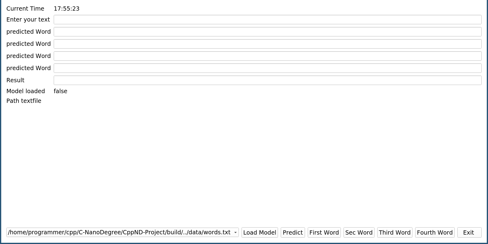
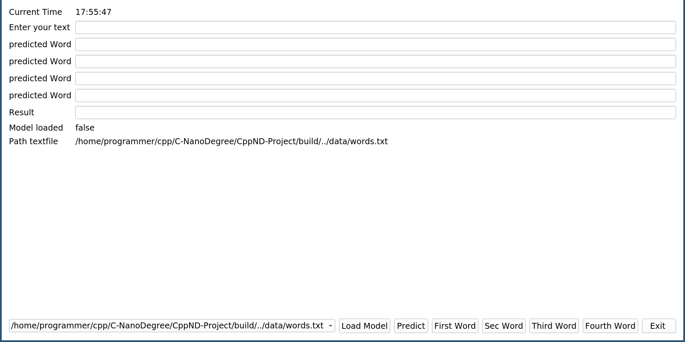
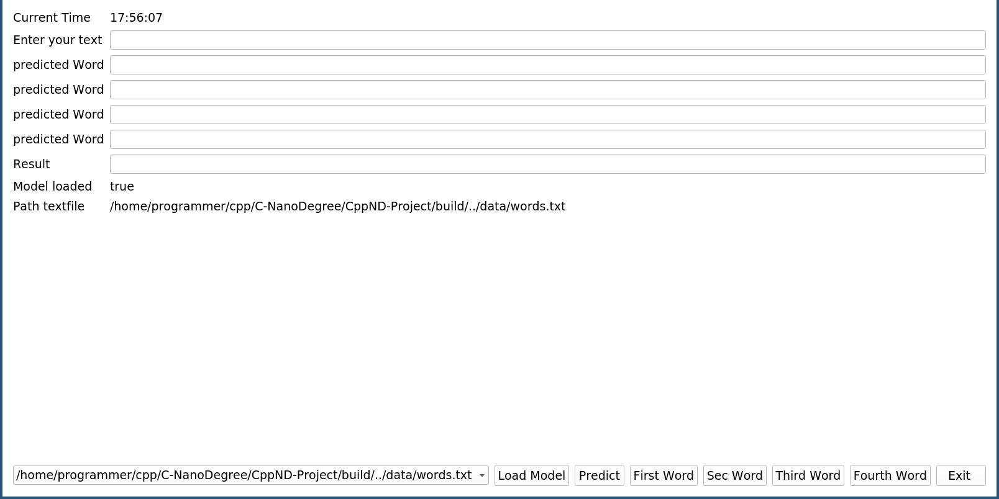
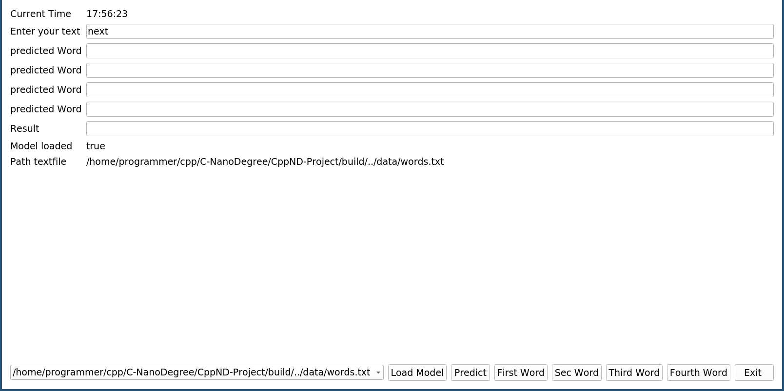
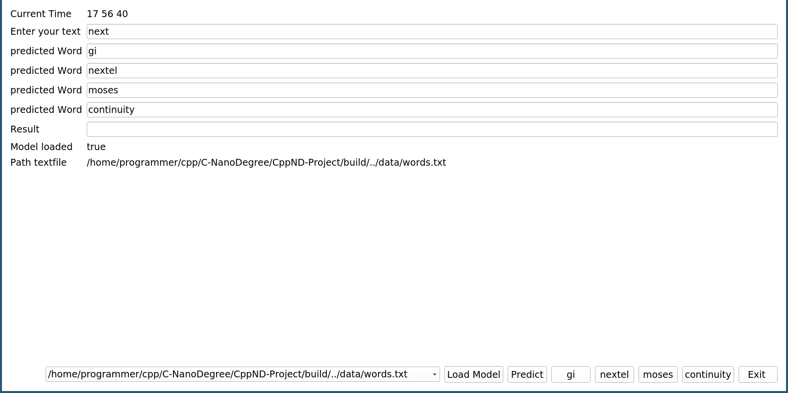
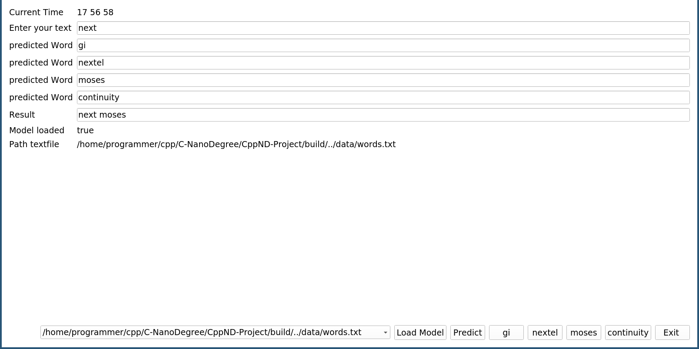

# CPPND: Project use Pytorch API and QT5 to predict next word 

In this Project, I create a visual Interface to use the Libtorch API to use an LSTM model to predict the next words according to the model weights. The model has been trained on books, and the weights just need to be loaded  into the model, choose a file with possible words and you are ready to go

## Dependencies for Running Locally
* cmake >= 3.7
  * All OSes: [click here for installation instructions](https://cmake.org/install/)
* make >= 4.1 (Linux, Mac), 3.81 (Windows)
  * Linux: make is installed by default on most Linux distros
  * Mac: [install Xcode command line tools to get make](https://developer.apple.com/xcode/features/)
  * Windows: [Click here for installation instructions](http://gnuwin32.sourceforge.net/packages/make.htm)
* gcc/g++ >= 5.4
  * Linux: gcc / g++ is installed by default on most Linux distros
  * Mac: same deal as make - [install Xcode command line tools](https://developer.apple.com/xcode/features/)
  * Windows: recommend using [MinGW](http://www.mingw.org/)

## Basic Build Instructions

This Instructions are varified on XUbuntu 18.04. 

1.Install qt5 by following the instructions link http://www.linuxfromscratch.org/blfs/view/svn/x/qt5.html (17.08.2020  
2.open the terminal `git clone https://github.com/ChrisProgramming2018/CPP-Project.git`  
3. go in to repository `cd CPP-Project/`  
4. create folder for pytorch source code  `mkdir third ` 
5. Use this link to Download the cpu pytorch https://download.pytorch.org/libtorch/cpu/libtorch-shared-with-deps-1.6.0%2Bcpu.zip  
6.  Unzip file `unzip third/libtorch-shared-with-deps-1.6.0+cpu.zip`  
7. move unpacked folder into third `mv libtorch/ third/`  
8. create folder for model `mkdir model`  
9. Download the pretrained model weights into model folder('model-trained.pt')  
10. Create  build folder and move into folder `mkdir build and cd build`  
11. Use cmake to create make file `cmake .. `  
12. Build excutable `make`  
13. open API `./gui-app`  
14. Now you should be able to see the following  Window   

# How to use the app

1. Choose the path for the word file ( words avaiable for the network)

2. Load the saved weights to the model
 
3. Add word in text window

4. Click to predict the 4 next most likly to the model

5. Click on the button with the word that fits for you 
6. The program adds the word to your input and displays  the outputs  

## For Capstone Project Review
### Loops, Functions, I/O
* The file Gui.cpp, LSTModel.cpp are have while and for loops read and laod data from files

### Memory Management
*At least two variables are defined as references, the Gui elements from qt QString QLable, ... 
### Object Oriented Programming
* The folder include/ defines the header files for the different classes 
* Create qt myDlg which inherits from QWidget and Worker Objets for the second thread   

### Concurrency
* need to use the QThread library to run the model in parallel to keep the prediction latency low 
